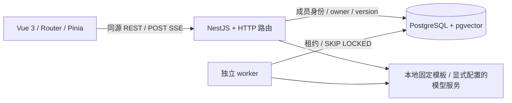
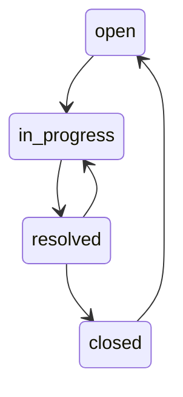

# 架构与数据边界

## 运行结构

本地无 PostgreSQL 时使用 PGlite（WASM PostgreSQL + vector），API 内嵌执行同一套 worker 逻辑。PGlite 不允许多个进程共享数据目录。配置 `DATABASE_URL` 后切换 Prisma PostgreSQL 数据访问；独立 worker 使用 `pnpm worker`。在 Compose 中 API 设置 `EXTERNAL_WORKER=true`。

`http.ts` 按认证、工单、会话、知识库、草稿分组挂载路由；领域约束在 `domain.ts`，模型/模板逻辑在 `ai.ts`。这是单体服务，不是微服务；后续可按模块拆分 HTTP 注册函数。

## 权限

Cookie 中是高熵随机会话令牌，数据库只存 SHA-256 哈希。密码使用 bcryptjs。用户身份仅来自会话，不接受请求体注入 created_by / workspace_id。写请求同时验证 Origin 和 CSRF 令牌。

所有对外业务查询显式指定 workspace_id。成员表决定 admin / agent / viewer 权限。跨表使用工作区复合外键强化一致性。工单可以共享；会话、消息、运行、引用、草稿还必须验证 owner_id / created_by，管理员不能读取他人的会话。

成员列表仅本工作区可读；负责人只能是本工作区管理员或客服。文档写操作仅管理员。访客不可创建或编辑工单，也不能使用 AI。错误统一为 code/message/requestId/details；不返回内部异常、密码、Key 或令牌。

## 工单与草稿事务

编辑和状态更新在同一数据库事务中锁定工单，检查前端 version，再递增版本并写审计。这样不会默默覆盖其他人的更改。备注只允许追加。

创建操作将调用人的 membership 行作为幂等序列化锁，检查 `(workspace, actor, operation, key)` 和规范化请求摘要。相同键不同内容 409；相同键相同内容返回原结果。

草稿确认额外锁定草稿；confirmed 草稿返回关联工单，因此不同 key 并发确认也不能创建第二张。工单、审计、草稿状态和幂等响应在同一事务提交。失败不留下半张工单。前端网络重试保留原 key 和已保存的草稿版本。

## 流式运行

使用 fetch POST，事件类型来自原始开发计划。SSEParser 在网络块之间保留 TextDecoder 和文本缓存，支持中文/emoji 跨块、多事件同块以及注释心跳。前端每 45 ms 合并文本更新。

数据库局部唯一索引保证同一会话、同一用户最多一个活动运行。clientRequestId 唯一约束防止重复调用。数据库还记录分钟及每日额度，事务条件更新避免并发透支。真实调用必须全部配置完整且双开关启用。

服务端每约 400 ms 保存部分内容，结束时强制写入。进程崩溃可能丢失最后不足一次快照间隔的文字。断线中止上游并保存 interrupted；不承诺断线续传。刷新从历史消息读取已经保存的内容。超过 3 分钟的残留运行由 worker 标记 interrupted。

取消先请求服务端，再中止客户端读取；本地取消交由生成函数保存最新部分内容。条件更新只允许活动态进入唯一终态。多实例取消由持久状态轮询发现，上游最长等待到下一文本分片或 90 秒总超时。重新生成创建新 run，并保存 regenerated_from。

## 知识库与引用

上传文档与创建 job 为同一事务。UTF-8 Markdown/TXT，每份 1 MB。分块目标 650 字符、80 字符重叠，记录原文偏移。每批 16 个片段嵌入，批次间续租；租约 120 秒，最多 3 次重试，指数退避。重复执行替换同版本分块，唯一键避免重复。

就绪和 active_version 切换在同一事务；旧任务不能覆盖更高版本。新版本失败时旧版本继续可用。检索先限定工作区、未删除、当前版本、就绪状态及 embedding 模型。精确余弦检索 topK 5；固定模板额外检查原文字面重合以减少哈希碰撞。

引用 ID 由服务端生成，只能来自已检索片段。消息保存引用快照，历史版本可标记追溯。删除立即排除未来检索，每个输出分片前重新检查来源删除状态；已删除来源不再返回快照。历史已生成答案仍可能含旧内容，不能声称已撤回。

资料是数据，不是授权。模板直接使用受控句式摘录资料；真实模型提示词要求忽略资料内指令，不具备任何执行工具。Markdown 经过 DOMPurify，移除脚本、事件、危险 URL、表单和图片加载。

## 已知边界

真实供应商未接入，因此未验证模型事实正确率、引用支持率、真实 token 用量与定价。模板模式的 embedding 是确定性字符哈希，不可当成语义模型。独立 PostgreSQL 与 Compose 在本机未执行，CI 包含对应回归。未实现 RLS、多实例即时广播取消或流断线续传。当前完整会话会一次加载，200 条消息的浏览器性能尚未实测。

已执行检查、评测分子/分母和未跑环境见 [验证报告](verification.md)。对照开发计划的完成情况见 [交付状态](delivery-status.md)。
